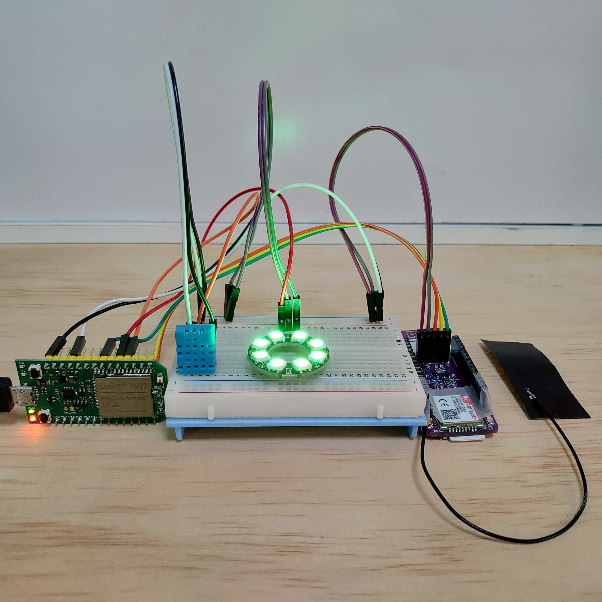
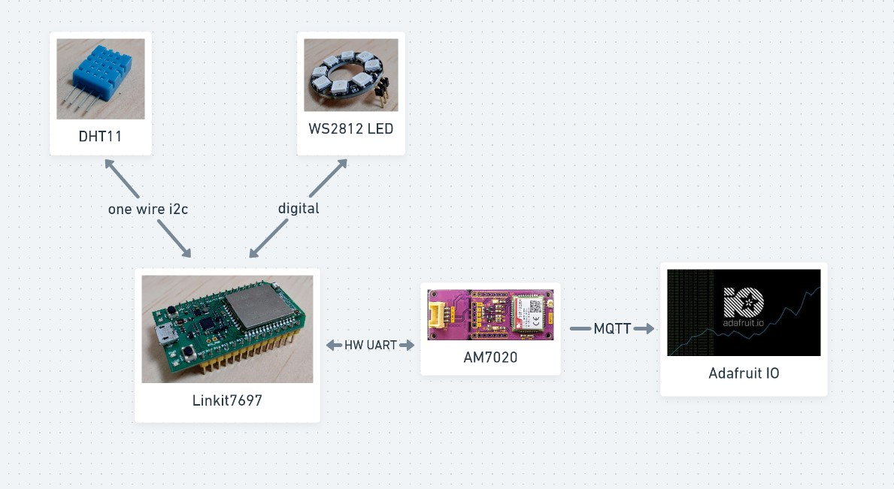
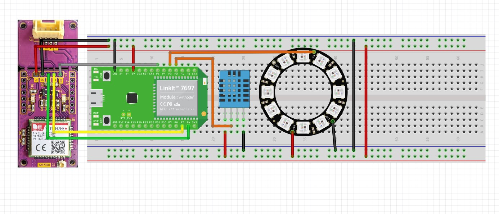
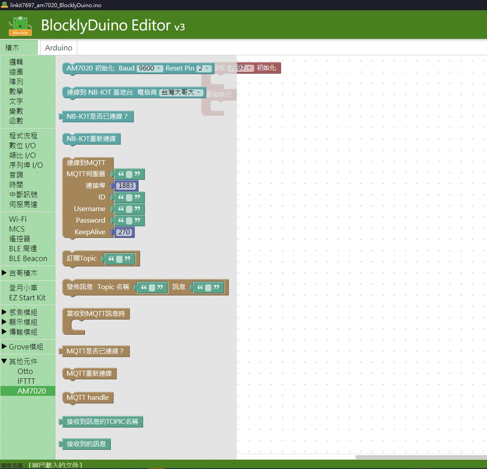
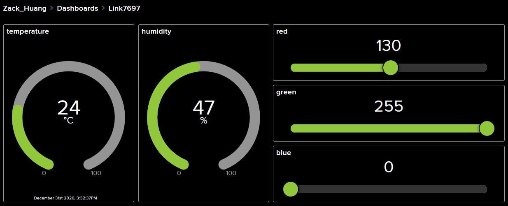

# linkit7697_AM7020
linkit7697_AM7020 使用BlocklyDuino搭配linkit7697、AM7020自製連網環境感測器！ 

* 整體架構

* 電路

* BlocklyDuino AM7020積木

* 成品（可在AdafruitIO Dashboard遠端查看資料及控制RGB LED）

* 詳細介紹文章：
[Linkit 7697 × NBIoT！用 LinkIt7697 BlocklyDuino 也能玩 NBIoT！？](https://www.atticedu.com/index.php/blog/am7020_blog/54-linkit-7697-%C3%97-nbiot%EF%BC%81%E7%94%A8-linkit7697-blocklyduino-%E4%B9%9F%E8%83%BD%E7%8E%A9-nbiot%EF%BC%81%EF%BC%9F.html)
